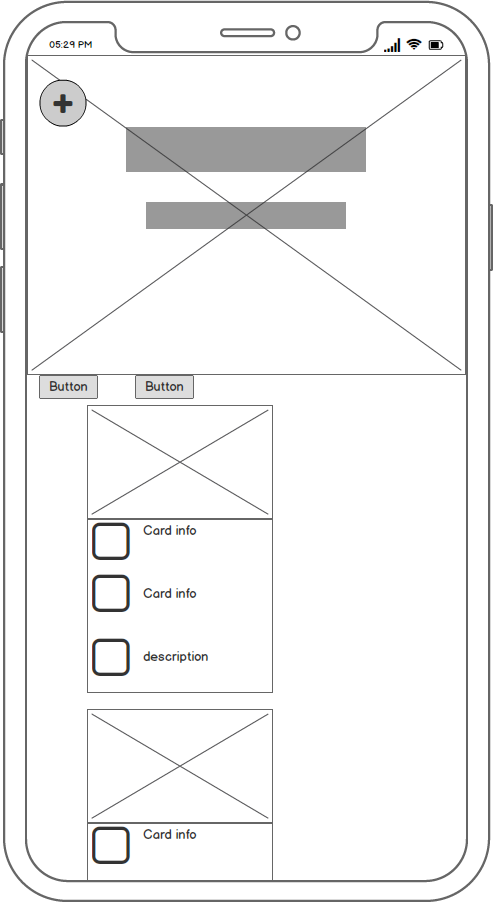
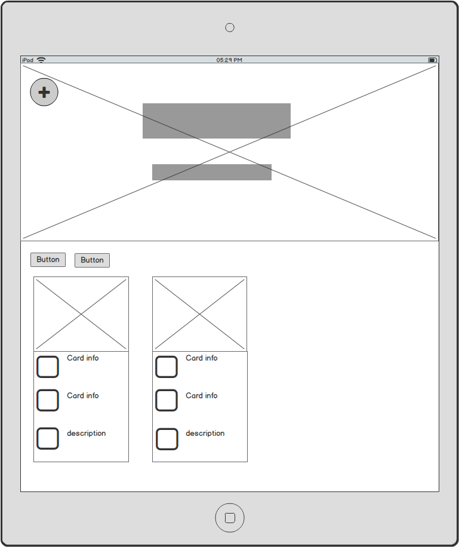
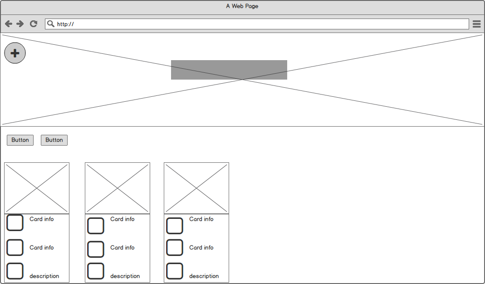

# Ascension

[Link to website]('https://ascensus-lg.herokuapp.com/getmovies')

## Mission:

There are many great films and books with tremendous value for anyone. However, these pieces of information are often overlooked because of the big movie blockbusters that Hollywood releases, or the next bestseller which will catch people's attention for a few weeks. In that sense, it sometimes is quite hard to find films and books which posses truly valuable and life-changing content. That's why Ascension was made. User's can check out what other people value and see whether that is something they would like themselves, but most importantly, add their own and share with others. The value of such a hub will only increase as amount users grows. That is what Ascension aims to be: A centralized hub of information and entertainment, for and provided by, the users. How fast will we Ascend?

---
### The target audience:

The type of user we target is someone who likes more value from the media that we all consume, be it an extra layer of philosophy or spirituality. Naturally, such a person would be open-minded, looking for more information and perspective to enrich his/her life. 

Living now, in the 21st century means that mental health is going to be a thing. We're all over-stimulated and not satisfied. The content we provide, and hope our users will also provide, is a different outlook on life. Many different perspectives, from many different films and books, so that the user can make up his own mind with all the information available to him/her. 

#### TL:DR
### Target Audience:
* Age : 20+ year olds
* People who think about life, what it might mean, and how to act
* People who are having a rough time in life and are looking for new way
* Avid book readers and film enthousiasts who'd like something different than the usual
* People with an interest in Philosophy and Spirituality, without taking part themselves
* People who would like to share their favourite film or book with the community
---

## Welcoming the User
Ascension aims to keep it's User Experience clean and organized. Not to much information heading towards the user when visiting the website. Next to that, emphasis is laid that the user intuitivly understands where to go and what to press to get where they want to go. 
Here is how we keep it simple:

* Buttons on the main page that clearly say what they will call (Books/Movies)
* Cards that show enough information for the user to understand what the content is
* A link underneath it that redirects the user to the content page where said content has all information to be shown
* Edit and Delete button on the complete content page.
* Add book and movie in the side Menu, easily accesible by a 'Menu' symbol that scrolls with the page

## User Stories
#### As a user interested in Philosophy, I expect to see a collection of movies or books which will interest me.

#### As a user interested in Spirituality, I expect to see a collection of movies or books which will interest me.

#### As a user interested in film, I expect to see movies which I might have missed and are worthwhile to watch.

#### As a user interested in reading, I expect to find books which I haven't read and normally wouldn't pick up.

#### As a user interested in human beings, I expect to gain understanding about what media or books people value.

#### As a user interested in sharing my favourite content, i expect to be able to add content in a easy, controlled manner for everyone to see

----

## Wireframes:

Mobile View: 

Ipad View: 

Desktop view 

-------
## Features 
* __Slider:__ Acts as a welcome to the website, slides through images and tells the user what is possible
* __SideNav:__ Allows the user to go back to the main page, add a book or movie. Choses to not take up space if not called upon.
* __GetBooks:__ Gets the books in the database and shows them as cards underneath the slider
* __GetMovies:__ Gets the movies in the database and shows them as cards underneath the slider
* __Full_Book:__ Gets all the information of the book and takes the user to a different page to view it
* __Full_Movie:__ Gets all the information of the movie and takes the user to a different page to view it
* __Add_Book:__ Allows the user to add a book to the database. All fields required. Title is checked in the database for duplication
* __Add_Movie:__ Allows the user to add a movie to the database. All fields required. Title is checked in the database for duplication
* __Edit_Book:__ Allows the user to edit an already existing book, granted they insert the right security code
* __Edit_Movie:__ Allows the user to edit an already existing movie, granted they insert the right security code
* __Delete_Book:__ Allows the user to delete an already existing book, granted they insert the right security code
* __Delete_Movie:__ Allows the user to delete an already existing movie, granted they insert the right security code
* __Check_Code:__ Checks the code the user provides compared to the one in the database, then gives permission to edit or delete

### Features Left to Implement

* Pagination: This to keep the main page clean and the cards contained. Improves User Experience
* login/registration: Allow the user to create an account and login so that session can be used. Improves overall useability.
* Comments: Allow users to write and read comments under the full_content page of a book or movie. Improves Community and adds funtionality
* Rating/like: Allows users to rate/like a movie or book, so we can see what is most valued. Improves functionality

## Information Architecture

### Categories

| Title       	| Key in Database 	| ObjectId      	|
|-------------	|-----------------	|---------------	|
| Category Id 	| _id             	| No Validation 	|
| Name        	| category_name   	| string        	|

----

### Books

| Title          	| Key in Database 	| Form Validation 	| DataType 	|
|----------------	|-----------------	|-----------------	|----------	|
| Book Id        	| _id             	| No Validation   	| ObjectId 	|
| Name           	| title           	| text            	| string   	|
| Person         	| author          	| text            	| string   	|
| Category       	| category        	| text            	| string   	|
| Description    	| description     	| text            	| string   	|
| Image          	| img_url         	| url             	| string   	|
| First comment  	| first_comment   	| text            	| string   	|
| Second comment 	| second_comment  	| text            	| string   	|
| Third comment  	| third_comment   	| text            	| string   	|
| Code           	| code            	| text            	| string   	|

----
### Movies

| Title            	| Key in Database   	| Form Validation 	| DataType 	|
|------------------	|-------------------	|-----------------	|----------	|
| Movie Id         	| _id               	| No Validation   	| ObjectId 	|
| Name             	| title             	| text            	| string   	|
| Person           	| director          	| text            	| string   	|
| Category         	| category          	| text            	| string   	|
| Time             	| runtime           	| text            	| string   	|
| Image            	| img_url           	| url             	| string   	|
| Card Description 	| small_description 	| text            	| string   	|
| Full_Description 	| big_description   	| text            	| string   	|
| code             	| code              	| text            	| string   	|

----
## Technologies used: 

* ### Languages
    * ### [Python](app.py)
    * #### [HTML](index.html)
    * #### [CSS](assets/css/style.css)
    * #### [JavaScript](assets/js/maps.js)
      * Initializing Google Maps and creating functions to create features on Google Maps 
    * #### [Jquery](https://jquery.com/)
      * Navigate the DOM more easily and connects Javascript functions to HTML elements
    * #### [Popper.js](https://popper.js.org/)
      * Needed for CSS dropdowns
* ### Framework
    * #### [Flask](https://flask.palletsprojects.com/en/1.1.x/)
      * Used for running a webapp, templating and many more functionalities
    * #### [PyMongo](https://pymongo.readthedocs.io/en/stable/)
      * Used for interacting with the MongoDB databas
    * #### [Bootstrap](https://getbootstrap.com/)
      * Used for responsive layout and basic styles
* ### Resources
    * ### [MongoDB](https://www.mongodb.com/)
      * Our database, holds all the records
    * ### [Heroku](https://www.Heroku.com/)
      * Hosts our website
    * #### [Google Fonts](https://fonts.google.com/)
       * Font Styles
    * ### [PEP8](http://pep8online.com/)
        * used to check and validate our python code for mistakes, inconsistencies and invalid indentation
    * #### [JSHint](https://jshint.com/)
        * Used to check Javascript code for mistakes, inconsistencies or typo's
    * #### [W3 Validator, HTML](https://validator.w3.org/#validate_by_input)
        * Used to check HTML code for mistakes, inconsistencies or typo's
    * #### [W3 Validator, CSS](https://jigsaw.w3.org/css-validator/)
         * Used to check CSS code for mistakes, inconsistencies or typo's

## Testing (taken from User Experience)
### Answering the questions:
### As a user interested in Philosophy, I expect to see a collection of movies or books which will interest me.
* I entered the website and the first things that i saw were the books and movies buttons. With one click i could start looking for the things im interested in
---
### As a user interested in film, I expect to see movies which I might have missed and are worthwhile to watch.
* I entered the website and pressed the movie buttons. I saw an interesting card and i click on the link for more information. There i was able to read the complete description.
---
### As a user interested in sharing my favourite content, i expect to be able to add content in a easy, controlled manner for everyone to see
* I entered the website and saw i needed to go to the menu. I opened the menu and was able to add a book or movie. The form was simple and easy to fill in. I also saw the option to edit or delete it later on
---
## What went wrong?
In the making of this project, loads of bugs were encountered. Mainly routing was something that came back often.  

### Adding a piece of content that already exists
I was able to create the same movie/book time and time again. 
Inside the insert_cotent code there is an if statement to counter that, but since it is case sensitive, you can make endless variations as long as one letter is different. This is not resolved yet, but will be by adding in a lower() function when inserting and ofcourse, capitalizing when showing.
----
### No route after updating
After updating, the function wouldn't bring you back to the full_content page instead giving a jinja error
The update function took the wrong argument. In the url_for(full_movie) had Updated_movie as an argument. Bson didn't take kindly to that. However, since the book_id or movie_id does not change after editing, movie_id=movie_id was valid. So it was replaced and the application hasn't shown errors anymore.
----
### Code inserted wasn't being accepted by the function
In order to delete or edit a code needs to be provided. It didnt matter if you did the right one or a wrong one on purpose.
By printing out the information the function received from the HTML, I figured out an extra KeyValuePair was provided, namely:
{"action" : ""}. After an embarrasingly long time, i realized the materialize button I used comes with a name="action" attribute to it.
It would also post the value of the button... I deleted the name attribute and the issue was resolved.
----

## Deployment

## How to the run this project locally
To run this project locally on your own IDE please follow the instructions below:

The following must be installed on your machine:

* PIP
* Python 3.7 (or higher)
* Git
* Either a [mongodb]('https://www.mongodb.com/) Cloud account or MongoDB running locally.
---
### Instructions
1. Download a clone of the GitHub repository selecting Download Zip
---

2. Open a terminal session in the unzip folder or cd to the correct location.

---
3. A virtual environment is recommended for the Python interpreter, I recommend using Pythons built in virtual environment. Enter the command:

`python -m venv <dir to install to e.g. .venv>`
NOTE: Your Python command may differ, such as python3 or py
----

4. Activate the .venv with the command:
`.venv\Scripts\activate` 
Again this __command may differ depending on your operating system__, please check the [Python Documentation on virtual environments](https://docs.python.org/3/library/venv.html) for further instructions.
----
5. Ensure pip is upto date with the following command
`pip install --upgrade pip.`
---
6. Install all required modules with the command
`Pip install -r requirements.txt.`
---
7. In your local IDE create a file called .flaskenv.
---

Inside the .flaskenv file, create a SECRET_KEY variable and a MONGO_URI to link to your own database. Please make sure to create a database named `Ascend` with `movies`, `books` and `categories`

8. For VSCode create a folder called .vscode and a file called settings.json inside then include the below items

 `"terminal.integrated.env.windows": {
    "SECRET_KEY": "",
    "DEV": "1",
    "HOSTNAME": "0.0.0.0",
    "PORT": "5000",
    "MONGO_URI": "[Database uri here]",
  }`
  ---
9. You can now run the application with the command

`python app.py`
---
10. You can visit the website at http://127.0.0.1:5000
----
## Heroku Deployment 

To deploy to heroku, take the following steps:

1. `git add` and `git commit` the new requirements and Procfile and then `git push` the project to GitHub.
---

2. Create a new app on the [Heroku website](https://www.heroku.com) by clicking the "New" button in your dashboard. Give it a name and set the region to Europe.
---

3. From the heroku dashboard of your newly created application, click on "Deploy" > "Deployment method" and select GitHub.
---

4. Confirm the linking of the heroku app to the correct GitHub repository.
---

5. In the heroku dashboard for the application, click on "Settings" > "Reveal Config Vars".
---

6.Set the following config vars:
---

* IP: 0.0.0.0

* PORT: 5000

* MONGO_URI: Your MONGO URI

* SECRET_KEY: Your SECRET_KEY

* To get you MONGO_URI read the [MongoDB Atlas documentation](https://docs.atlas.mongodb.com/)
---

7. In the Heroku dashboard, click "Deploy".
---

8. In the "Manual Deployment" section of this page, made sure the master branch is selected and then click "Deploy Branch".
---

9. The site is now successfully deployed.
---

## Credits
### Content:
All movie data was taken either from [IMDB](https://www.imdb.com/) or [Wikipedia](https://en.wikipedia.org/wiki/Main_Page)

### Media
####Images used
All taken from **[Unsplash](https://unsplash.com/)
* **Simon berger - clouds**
* **Patrick Schneider - steppe**
* **Aaron burden - bookchild**
* **Anunay Mahajan - give**
* **Jordan Hile -  hill**
* **Fabian auth - stairs**
* **chuttersnap - color-pallete**

### Acknowledgements
* __Aaron Sinnot:__ My mentor who's helped me from the conceptual phase all the way to the debugging
* __Igor Basuga:__ Fellow student at CodeInstitute, who has helped me immensly.

## DISCLAIMER
Please note the content and images on this website are for educational purposes only.
[Link to website]('https://ascensus-lg.herokuapp.com/getmovies')
